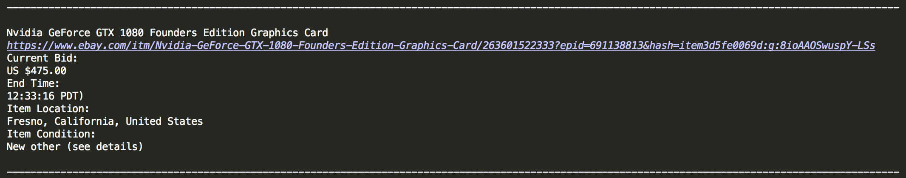

# GPU_webcrawler
During the Great GPU Mining Shortage of 2018, I created a python web crawler to quickly find real-time (inflated) market prices of GPU's. I used my program to compare in stock GPU prices found elsewhere.

